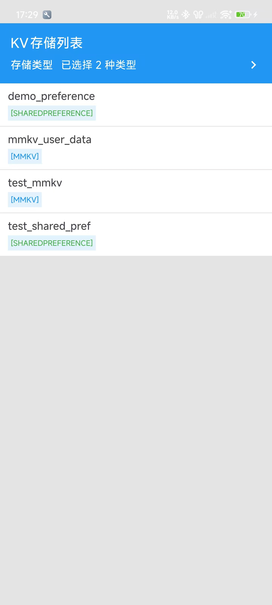
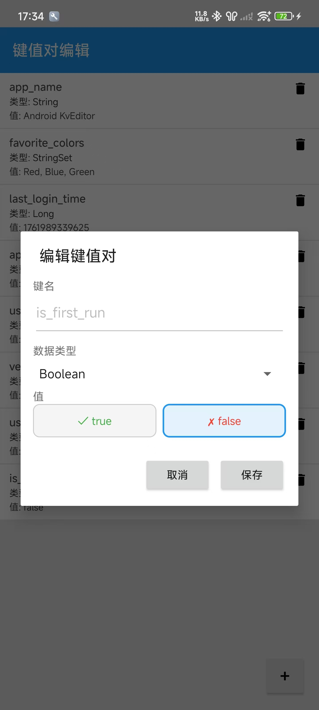

# Android-KvEditor

一个用于开发环境的轻量级Android键值对编辑器，支持SharedPreference和MMKV存储类型，自带界面用于查看、添加、编辑和删除键值对数据。




## 功能特点

- 支持多种存储类型：SharedPreference和MMKV
- 可视化编辑键值对数据
- 支持多种数据类型：字符串、整数、长整数、浮点数、布尔值、字符串集合
- 自动检测并显示应用中的存储文件

## 支持的数据类型

| 数据类型 | 说明 |
|---------|------|
| STRING | 字符串类型 |
| INTEGER | 整数类型 |
| LONG | 长整数类型 |
| FLOAT | 浮点数类型 |
| BOOLEAN | 布尔值类型 |
| STRING_SET | 字符串集合类型 |

## 支持的存储类型

| 存储类型 | 说明 |
|---------|------|
| SHARED_PREFERENCE | Android标准的SharedPreference存储 |
| MMKV | 高性能的MMKV存储引擎 |

## 安装

### 要求

- Android 5.0+ (API 21+)
- Java 8+

### Gradle依赖

在项目级`build.gradle`中添加：

```gradle
repositories {
    mavenCentral()
}
```

在应用模块的`build.gradle`中添加：

```gradle
dependencies {
    implementation 'io.github.xesam:android-kveditor:0.0.1'
    // 如果使用MMKV存储类型，需要在主项目中额外添加MMKV依赖
    implementation 'com.tencent:mmkv:x.y.z'
}
```

## 使用方法

### 基本使用

```java
import io.github.xesam.android.kveditor.KvEditor;
import io.github.xesam.android.kveditor.StorageType;

// 在Activity或Fragment中打开KV编辑器（默认支持所有存储类型）
KvEditor.open(context);
// 指定支持的存储类型（使用可变参数）
KvEditor.open(context, StorageType.SHARED_PREFERENCE, StorageType.MMKV);
```

## 许可证

MIT